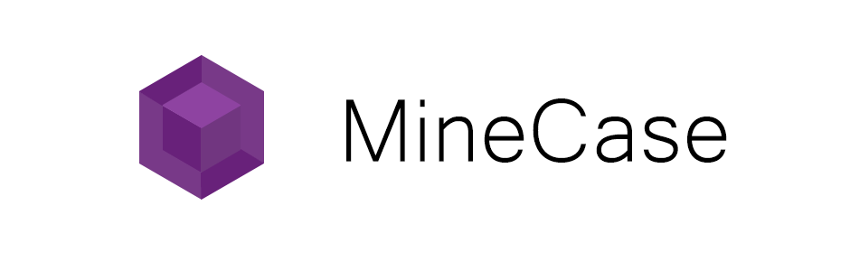

MineCase 
=========================================
#### [](https://travis-ci.org/dotnetGame/MineCase)   [](https://ci.appveyor.com/project/sunnycase/minecase/branch/master) 
<a href="https://www.patreon.com/SooChowJunWang"></a>



#### [English](https://github.com/dotnetGame/MineCase/blob/master/README.md) | [中文](https://github.com/dotnetGame/MineCase/blob/master/README-zh.md) 


#### [English](https://github.com/dotnetGame/MineCase/blob/master/README.md) | [中文](https://github.com/dotnetGame/MineCase/blob/master/README-zh.md) 

`MineCase` 是一个跨平台、分布式的 `Minecraft` 服务端应用。

本项目使用 `.NET Core` 编写，基于 [orleans](https://github.com/dotnet/orleans) 框架。它通过 Actor 模型将各个模块分离开来，从而构建一个高效的分布式系统。

不同的区块由不同的服务器管理，所有的玩家都可以在同一个世界进行游戏，这位minecraft服务器带来了更多的拓展性。

目前仅支持 `Minecraft` [1.12](https://minecraft.net/en-us/article/minecraft-112-pre-release-6) 的版本。


## 运行需要
* [.Net Core 2.0](https://www.microsoft.com/net/download)
* [MongoDB](https://www.mongodb.com/download-center/community)

## 安装

## 从源码编译安装
* 1 . 下载并安装 [.NET Core sdk](https://www.microsoft.com/net/download)。
* 2 . 下载并安装 [MongoDB](https://www.mongodb.com/download-center?jmp=nav#community)。
* 3 . 从 [github page](https://github.com/dotnetGame/MineCase/archive/master.zip) 下载`MineCase`(或者使用 **clone:** 指令)。
	```bash
	git clone git@github.com:dotnetGame/MineCase.git
	cd MineCase
	```
* 4 . 解压 `Minecase` 压缩包.
* 5 . 构建并运行 `build_and_run`
    * **OSX** : 运行 `build_and_run.sh`.
    * **Linux** : 运行 `build_and_run.sh`.
    * **Win** : 双击 `build_and_run.bat`.

## 使用docker安装
* 1 . 下载[Docker for linux](https://docs.docker.com/engine/installation/)。
* 2 . 解压 `Docker for linux`，然后在linux上运行 `server`

	```bash
	url=https://raw.githubusercontent.com/dotnetGame/MineCase/master/build/docker/linux/docker-compose.yml
	curl -o docker-compose.yml $url
	docker-compose up
	```
	##### 建议:
	* 你可以输入 `docker-compose stop`停止服务器的运行。

## 参与开发
我们需要帮助以使MineCase更好。 您可以通过修复错误，开发新功能，改进文档来帮助我们。
一些新的贡献者想知道该做些什么来帮助我们的开发。 该项目始于对Minecraft的热爱，所以我们的答案始终是“做你喜欢的事”。
我们珍爱你们的帮助，更喜爱看到你们在MineCase中做着你们所热爱的工作。

## 联系我们
　　此项目尚在开发之中。
您可以使用`Pull Requests`提交您的代码或者通过`e-mail` 或 `issues` 联系我们， 我会将您的加入我们开发团队之中。如果你有任何问题可以在[Issues](https://github.com/dotnetGame/MineCase/issues)中一同讨论。当您在使用MineCase的过程中遇到任何问题或者你有好的建议，也可以通过[Issues](https://github.com/dotnetGame/MineCase/issues)发给我们。
我们欢迎且感谢您对我们项目的贡献。

* 通过e-mail联系我: sunnycase@live.cn
* [Discord](https://discord.gg/8Z5RSRn) : MineCase
* QQ群: 667481568

[License (MIT)](https://raw.githubusercontent.com/dotnetGame/MineCase/master/LICENSE)
-------------------------------------------------------------------------------
	MIT License
	
	Copyright (c) 2017-2019 MineCase
	
	Permission is hereby granted, free of charge, to any person obtaining a copy
	of this software and associated documentation files (the "Software"), to deal
	in the Software without restriction, including without limitation the rights
	to use, copy, modify, merge, publish, distribute, sublicense, and/or sell
	copies of the Software, and to permit persons to whom the Software is
	furnished to do so, subject to the following conditions:
	
	The above copyright notice and this permission notice shall be included in all
	copies or substantial portions of the Software.
	
	THE SOFTWARE IS PROVIDED "AS IS", WITHOUT WARRANTY OF ANY KIND, EXPRESS OR
	IMPLIED, INCLUDING BUT NOT LIMITED TO THE WARRANTIES OF MERCHANTABILITY,
	FITNESS FOR A PARTICULAR PURPOSE AND NONINFRINGEMENT. IN NO EVENT SHALL THE
	AUTHORS OR COPYRIGHT HOLDERS BE LIABLE FOR ANY CLAIM, DAMAGES OR OTHER
	LIABILITY, WHETHER IN AN ACTION OF CONTRACT, TORT OR OTHERWISE, ARISING FROM,
	OUT OF OR IN CONNECTION WITH THE SOFTWARE OR THE USE OR OTHER DEALINGS IN THE
	SOFTWARE.


