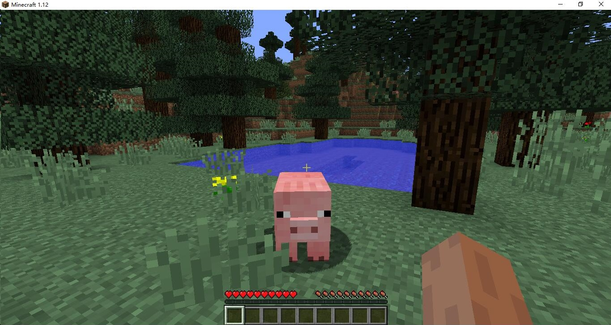

MineCase 
======================================
#### [](https://travis-ci.org/dotnetGame/MineCase)   [](https://ci.appveyor.com/project/sunnycase/minecase/branch/master) 
<a href="https://www.patreon.com/SooChowJunWang"></a>


#### [English](https://github.com/dotnetGame/MineCase/blob/master/README.md) | [中文](https://github.com/dotnetGame/MineCase/blob/master/README-zh.md) 

`MineCase` is a `Minecraft` server implement in dotnet core. 
The project is designed to create a high-performance, distributed `Minecraft` server with virtual actor provided by Orleans distributed framework. 
Different chunks are managed on different servers so that more players can join in and play in the same world. This makes minecraft servers more scalable.
Servers like Anarchy servers can allow more players to join in without waiting in queue by using distributed server.
It written in `C#` with `.NET Core 3.1` env and based on `orleans` framework to work with released [1.15.2 protocol](https://www.minecraft.net/en-us/article/minecraft-java-edition-1-15-2). The [website](https://wiki.vg/) describes the Minecraft protocol clearly.

**MineCase is under refactoring, so branch refactor may not work.**

**MineCase is not stable and lack of many features now. Please don't use MineCase in production unless you know what you're doing.**



## Run Requirements
* [.Net Core 3.1](https://www.microsoft.com/net/download)
* [MongoDB](https://www.mongodb.com/download-center/community)

## Install (Build From Source)
* 1 . Download and install a `.NET Core sdk` from this [page](https://www.microsoft.com/net/download).
* 2 . Download and install a `MongoDB` from this [page](https://www.mongodb.com/download-center?jmp=nav#community).
* 3 . Download a `MineCase` archive from the [github page](https://github.com/dotnetGame/MineCase/archive/master.zip)  (or **clone:**)
	
	```bash
	git clone git@github.com:dotnetGame/MineCase.git
	cd MineCase
	```
* 4 . Un-zip `Minecase` archive.
* 5 . Build and run the `build_and_run`
    * **OSX** : Run the `build_and_run.sh`.
    * **Linux** : Run the `build_and_run.sh`.
    * **Win** : Double-click `build_and_run.bat`.

## How it works
None


## Contributors
<div>
<span>
<a href="https://github.com/sunnycase">

</a>
</span>
<span>
<a href="https://github.com/jstzwj">

</a>
</span>
<span>
<a href="https://github.com/akemimadoka">

</a>
</span>
<span>
<a href="https://github.com/Alinshans">

</a>
</span>
<span>
<a href="https://github.com/ray-cast">

</a>
</span>
<span>
<a href="https://github.com/Melonpi">

</a>
</span>
<span>
<a href="https://github.com/zaoqi">

</a>
</span>
</div>


## Credits

**Patreon supporters list**

Wooden Pickaxe Supporter:

<div>
<a href="https://www.patreon.com/acid_chicken">

</a>Acid Chicken
</div>
<div>
<a href="https://www.patreon.com/user/creators?u=4934636">

</a>Balajanovski
</div>

## Get Involved

We need help to make MineCase better. You can help us by fixing bugs, developing new features, improving documents.  
Some new contributors wonder what to work. The project began with the love for Minecraft, so our answer is always "do what you love". 

## Contact
This project is still under development. 
You can submit code by using `Pull Requests` or Feel free to contact me via `e-mail` or `issues`, I'll add your profile to team members
and if you have any questions we can discuss together in the [Issues](https://github.com/dotnetGame/MineCase/issues).
and also any questions you may have while using this server, or any good suggestions, can be addressed to us in [Issues](https://github.com/dotnetGame/MineCase/issues).
we welcome and thank your contribution for this project.

* Reach me via e-mail: sunnycase@live.cn
* Discord : [MineCase](https://discord.gg/8Z5RSRn)
* QQ Group: 667481568

[License (MIT)](https://raw.githubusercontent.com/dotnetGame/MineCase/master/LICENSE)
-------------------------------------------------------------------------------
	MIT License
	
	Copyright (c) 2017-2020 MineCase
	
	Permission is hereby granted, free of charge, to any person obtaining a copy
	of this software and associated documentation files (the "Software"), to deal
	in the Software without restriction, including without limitation the rights
	to use, copy, modify, merge, publish, distribute, sublicense, and/or sell
	copies of the Software, and to permit persons to whom the Software is
	furnished to do so, subject to the following conditions:
	
	The above copyright notice and this permission notice shall be included in all
	copies or substantial portions of the Software.
	
	THE SOFTWARE IS PROVIDED "AS IS", WITHOUT WARRANTY OF ANY KIND, EXPRESS OR
	IMPLIED, INCLUDING BUT NOT LIMITED TO THE WARRANTIES OF MERCHANTABILITY,
	FITNESS FOR A PARTICULAR PURPOSE AND NONINFRINGEMENT. IN NO EVENT SHALL THE
	AUTHORS OR COPYRIGHT HOLDERS BE LIABLE FOR ANY CLAIM, DAMAGES OR OTHER
	LIABILITY, WHETHER IN AN ACTION OF CONTRACT, TORT OR OTHERWISE, ARISING FROM,
	OUT OF OR IN CONNECTION WITH THE SOFTWARE OR THE USE OR OTHER DEALINGS IN THE
	SOFTWARE.
