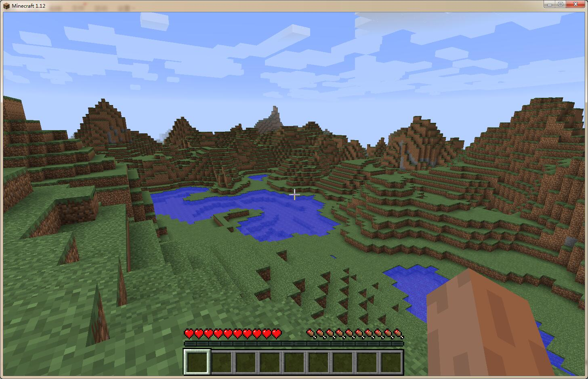

MineCase
[](https://ci.appveyor.com/project/sunnycase/minecase/branch/master)
===



## 介绍
`MineCase` 是一个分布式的 `minecraft` 服务端应用。`MineCase` 采用 `.net core` 编写，使用 `Orleans` 框架。<br>
`MineCase` 具有以下特性：

* 跨平台
* 分布式

## 要求
运行这个服务器之前，请保证你的环境满足：

* `.net core` sdk 2.0

目前支持的 `minecraft` 版本：

* 1.12

## 开始

>注：本项目还在施工阶段，所以还不能把游戏跑起来。

1. 获取源码
```bash
git clone git@github.com:dotnetGame/MineCase.git
```
或者 [下载ZIP](https://github.com/dotnetGame/MineCase/archive/master.zip)。

2. 构建并运行

进入 `MineCase` 目录下，运行 `run_server.bat`，看到下面这一行提示的时候：
```
Press Ctrl+C to terminate...
```
再运行 `run_gateway.bat` 。

## 进度

| 模块 | 完成情况 |
|:---:|:---:|
|握手协议|:white_check_mark:|
|登陆|:white_check_mark:|
|进入世界|:white_check_mark:|
|地图生成|:x:|
|怪物生成|:x:|
|AI|:x:|

## 反馈

如果你在使用 `MineCase` 的过程中遇到任何问题，请在 [Issues](https://github.com/dotnetGame/MineCase/issues) 中提出。

***

## Introduction
`MineCase` is a distributed `minecraft` server application. It is written in `.net core`, and using the `Orleans` framework. <br>
`MineCase` has the following features:

* cross-platform
* distributed

## Required
Before running this server, please make sure your environment meet:

* `.net core` sdk 2.0

Currently supported version of `minecraft`:

* 1.12

## Getting Start

>Note: This project is still in the construction phase, so the game can not run.

1. Get source
```bash
git clone git@github.com:dotnetGame/MineCase.git
```
or [Download ZIP](https://github.com/dotnetGame/MineCase/archive/master.zip).

2. Build and run

Entry the `MineCase` directory, run `run_server.bat`, and when you see the following line：
```
Press Ctrl+C to terminate...
```
run `run_gateway.bat` .

## Schedule

|Module|Finished|
|:----:|:----:|
|handshake|:white_check_mark:|
|log in|:white_check_mark:|
|entry the world|:white_check_mark:|
|map generation|:x:|
|monster generation|:x:|
|AI|:x:|

## Feedback
If you encounter any problems with the use of `MineCase`, please point out that in [Issues](https://github.com/dotnetGame/MineCase/issues).
